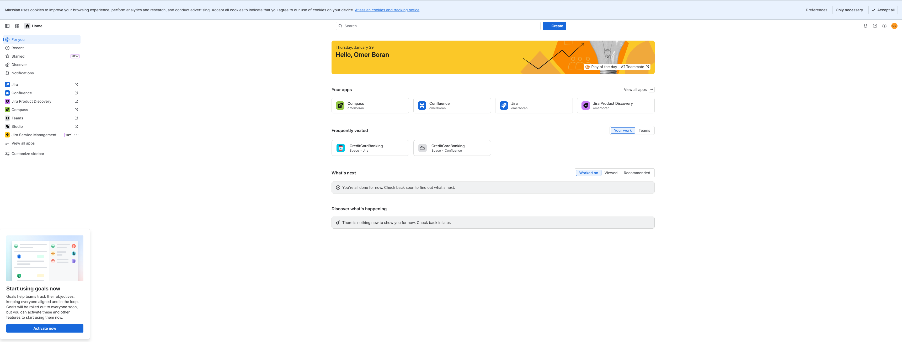
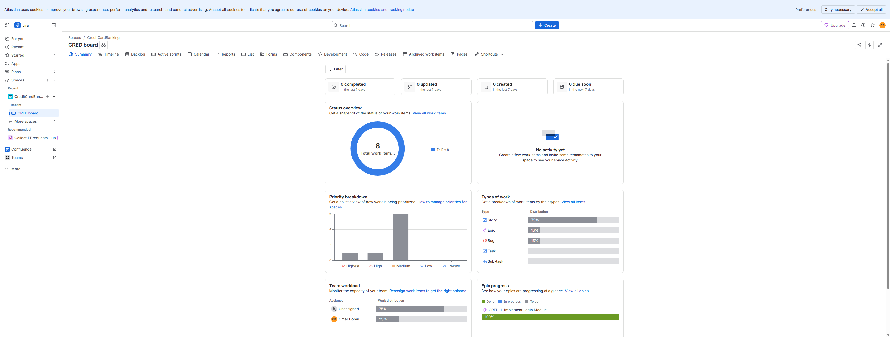
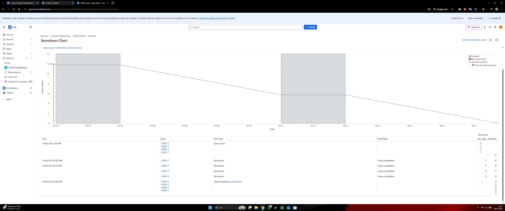
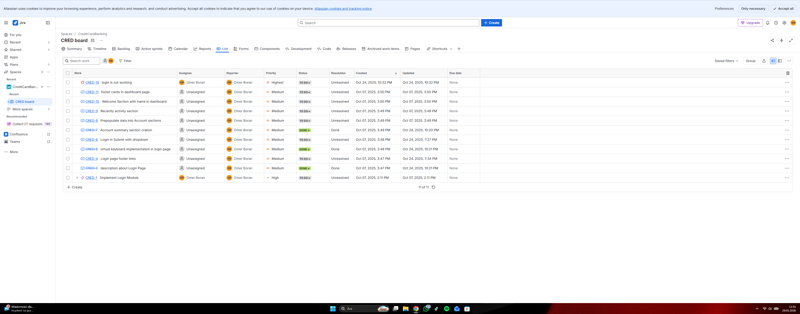
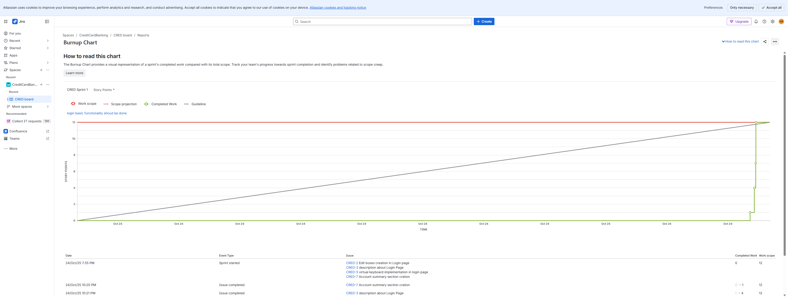
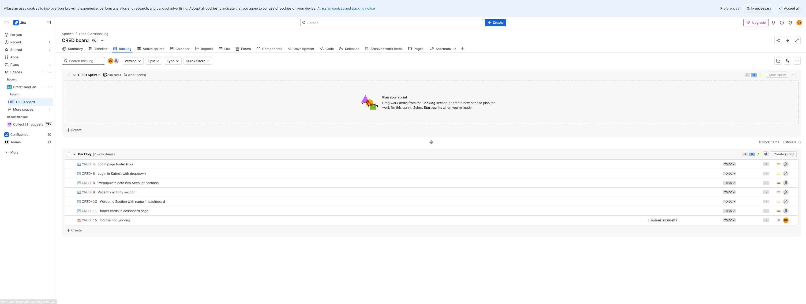

# Credicard Banking - Jira Managed Project

This project is a banking system prototype focused on credit card operations. It was managed using Jira for task tracking and agile workflow.

This repository represents a banking system project focused on credit card operations.
The project was fully planned and managed using Jira.

## Project Management
- Jira Cloud was used for backlog management, epics, user stories, and sprint planning
- Tasks were tracked using Agile/Scrum methodology
- Each feature was defined as Jira issues before development

## Scope
- Credit card creation and management
- Payment and transaction workflows
- User account operations
- Error handling and validation scenarios

## Workflow
1. Requirements were created as Epics and User Stories in Jira
2. Tasks were prioritized in the backlog
3. Sprints were planned and tracked in Jira
4. Progress was monitored using Jira boards and reports

## Tools
- Project Management: Jira Cloud
- Version Control: GitHub
- Methodology: Agile / Scrum

## Notes
This repository is intended to demonstrate project planning,
task breakdown, and agile workflow rather than production-ready code.
